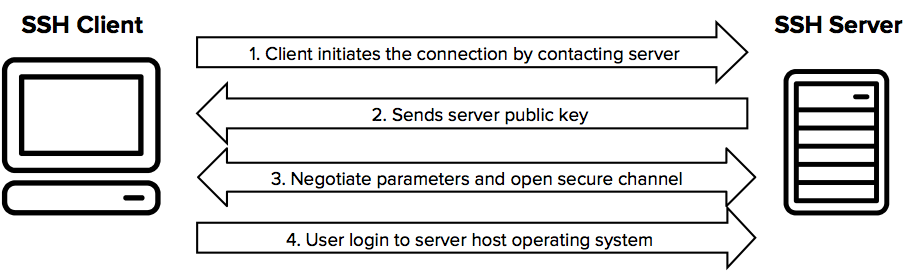

# RDP & SSH
## Introduction
Le RDP ou Remote Desktop Protocol, est un protocole de Windows permettant l’accès à des machines virtuelles et des serveurs physiques Windows part le biais du **port 3389**. Son GUI (Graphical User Interface) facilite grandement l’utilisation aux utilisateurs peu expérimentés avec Bash. Un VPN (Virtual Private Network)  est recommandé, voire même un MFA (Multi-Factor Authentication).

Le SSH ou Secure Shell, quant à lui, est un **protocole** optimisé pour l’accès à des serveurs Linux par le **port 22**, mais il est utilisable avec tous les systèmes d’exploitation de serveurs. L’utilisateur doit savoir utiliser Bash pour pouvoir l’utiliser. Le SSH fonctionne avec un système de clés privées et publiques, ce qui le rend nativement plus sûr qu’avec l’utilisation de credentials, comme pour le RDP.

[Description et comparaison du RDP et SSH.](https://jumpcloud.com/blog/rdp-ssh)
___
## Architecture Client-Serveur
L’architecture client-serveur consiste en un programme dit “client” qui envoie des requêtes au programme “serveur” qui à son tour répond au client. Le serveur offre alors un service au client. Par extension, le client désigne souvent l'ordinateur sur lequel est exécuté le logiciel client, et le serveur, l'ordinateur sur lequel est exécuté le logiciel serveur.


[Description Architecture Client-Serveur.](https://fr.wikipedia.org/wiki/Client-serveur)
___
## Utiliser un GUI avec du SSH?
Il est possible d’utiliser le protocole SSH avec une interface graphique si l’on autorise le X11 Forwarding sur le serveur. Par défault cette option est désactivée car il n'est souvent pas nécessaire d'avoir l'interface graphique des serveurs lors que l'on veut y accéder et parfois elle n'est même pas installée sur le serveur.
___
## Se connecter à un ordinateur distant en SSH
Pour se connecter à un ordinateur distant, il suffit d’avoir un client SSH installé (Cmder installe le client SSH automatiquement). En plus de ça, il faut que l’ordinateur distant ait un serveur SSH actif. Dans le terminal entrez la commande suivante pour connecter le client au serveur:

```
ssh [nom d’utilisateur distant]@[ip de l’ordinateur distant]
```

[Vidéo installation du client SSH et connexion à un ordinateur distant.](https://www.youtube.com/watch?v=JbMgOKlj5fE)
___
## Schéma de la mise en place d'un tunnel SSH
### Schéma d'un tunnel SSH:


### Schéma de la mise en place du tunnel SSH:


On voit ici, de manière très simplifiée, comment le système à clé publique et clé privée fonctionne pour établir le tunnel SSH.

### Représentation d'une connexion SSH entre deux réseaux:


(Notre schéma logique sera fait lorsque nos connexion SSH seront établies entre le CPNV et nos domiciles.)

## Sources
Schéma d'un tunnel SSH:   
https://persistentssh.com/docs.php

Schéma de la mise en place du tunnel SSH:   
https://www.venafi.com/education-center/ssh/what-is-ssh

Représentation d'une connexion SSH entre deux réseaux:   
http://supnumwang.blogspot.com/2011/11/short-guide-to-ssh-port-forwarding.html